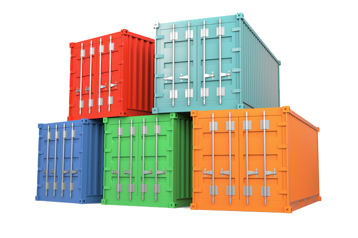
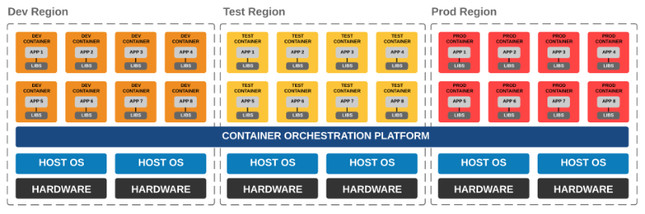
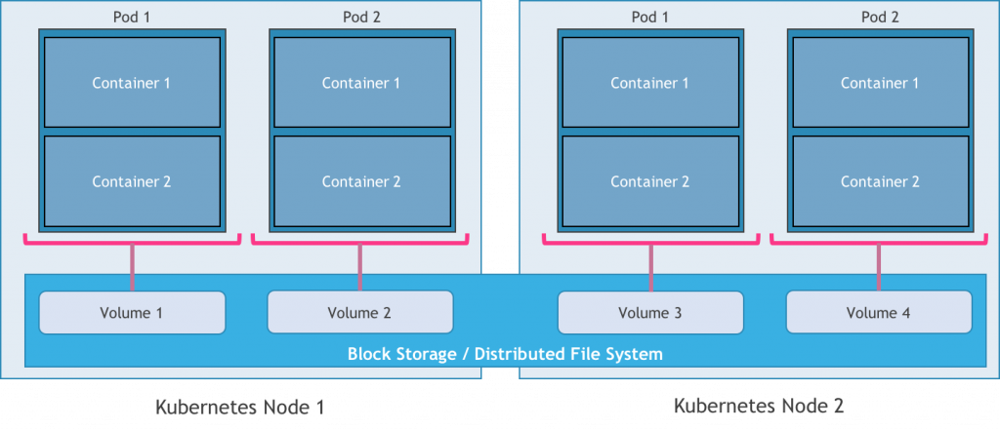
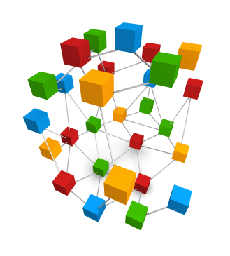
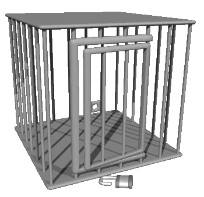
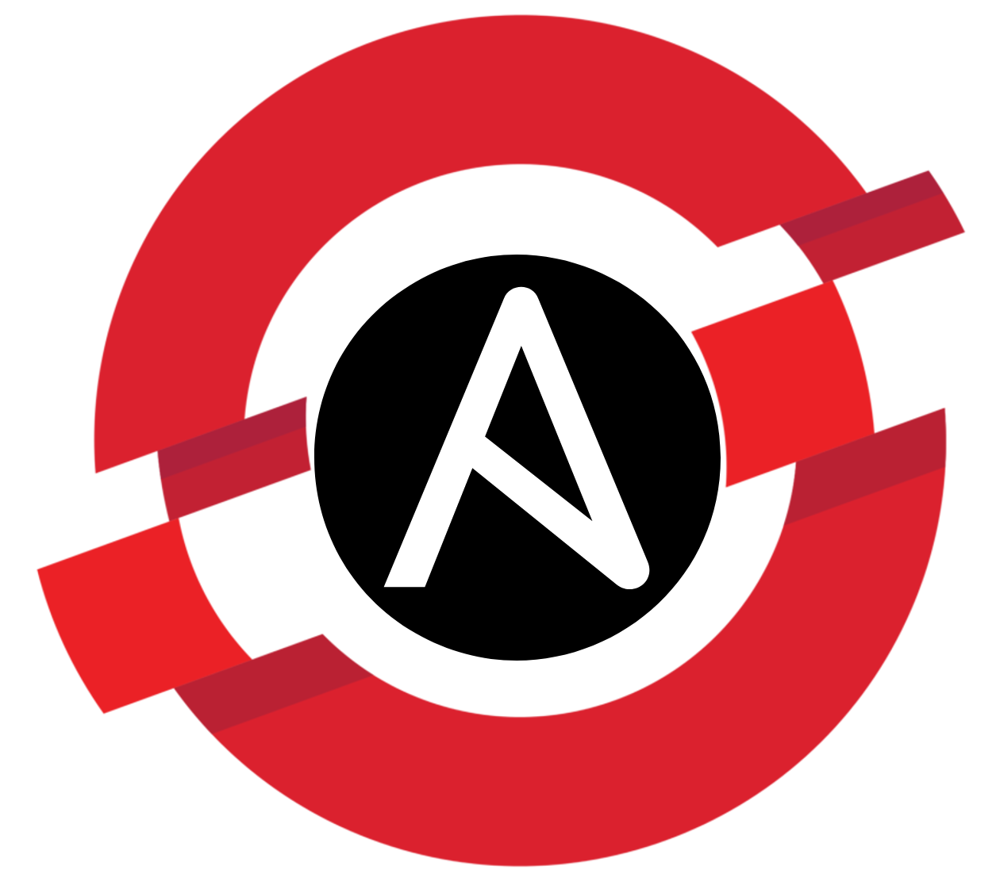
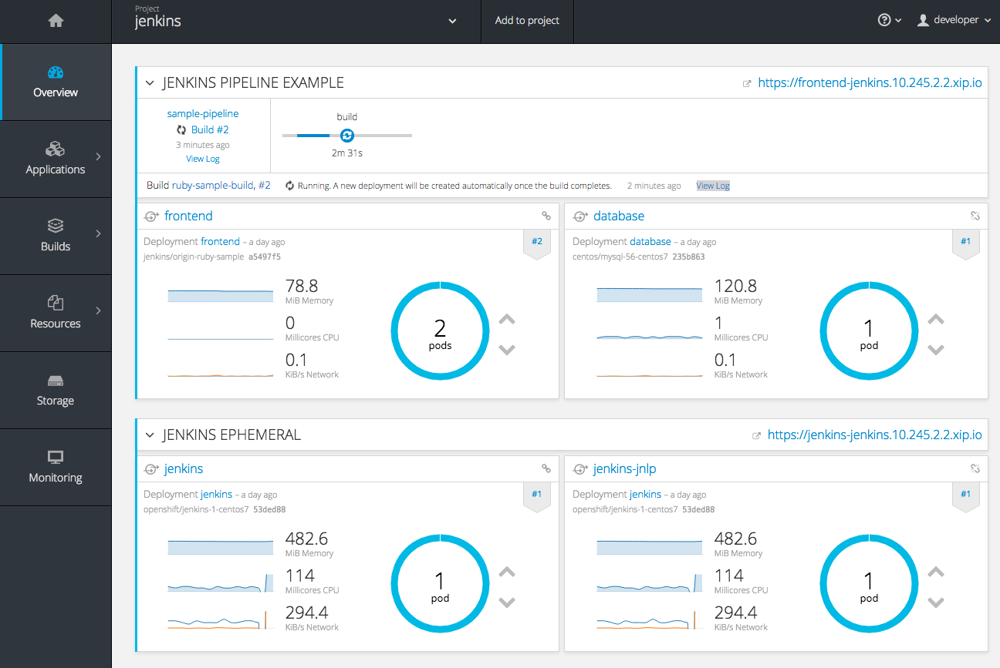
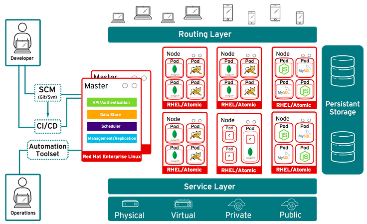

# Duchesse

### D'un conteneur à la production

---

### Qui suis je ? 

---

### De quoi on va parler ? 

- Conteneur et docker <!-- .element: class="fragment" -->  
- Kubernetes <!-- .element: class="fragment" -->  
- OpenShift <!-- .element: class="fragment" --> 

---

## Conteneurs 

  

---

### Un conteneur ce n'est pas 

  
- Ce n'est pas une VM  <!-- .element: class="fragment" --> 
- Ce n'est pas que docker  <!-- .element: class="fragment" -->

---

### Qu'est ce qu'un conteneur ? 

- Isolation d'un processus  <!-- .element: class="fragment" -->
- Format de packaging  <!-- .element: class="fragment" -->
- Open conteneur Initiative  <!-- .element: class="fragment" -->

---

### Pourquoi c'est cool ? 

- Reproductibilité des environements  <!-- .element: class="fragment" --> 
- Optimisation des ressources  <!-- .element: class="fragment" -->
- Facilité (eventuelle) à scaler  <!-- .element: class="fragment" -->

---

## Un peu de demo

Note:
- Demo d'un conteneur simple en local
- Vu des images
- Docker PS, docker stat
- PS, top

---

### Il faudrait orchestrer...

- Orchestration / scheduling  
- Garantie de HA  
- Optimisation des resources

  

---

### Il faudrait persister...

  

---

### Il faudrait exposer...

- Communication entre les services
- Load balancing

  

---

### Il faudrait sécuriser...

  

Note: 
Pas une VM => 

---

## Kubernetes

  

---

### Un schéma d'architecture

  

---

### A quoi ça sert ? 

- Scheduling  <!-- .element: class="fragment" --> 
- Persistent Volume  <!-- .element: class="fragment" -->
- Security Context  <!-- .element: class="fragment" -->

---

## OpenShift 

---

### Facilité d'installation

Note: 
Production ready, 3 masters, sécurité, on prem

---

### Console d'administration

---

### Sécurité 

- Gestion de user 
- Security Context Constraint 
- Registry avec authorisations
- Multi tenant

---

### Build, CI CD 

- Source to image (S2I)
- Integration Jenkins

---

### Et encore un schéma d'architecture...

  
